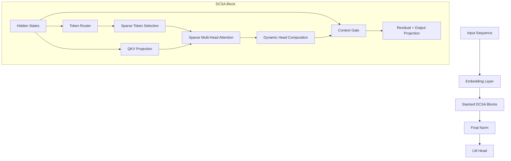
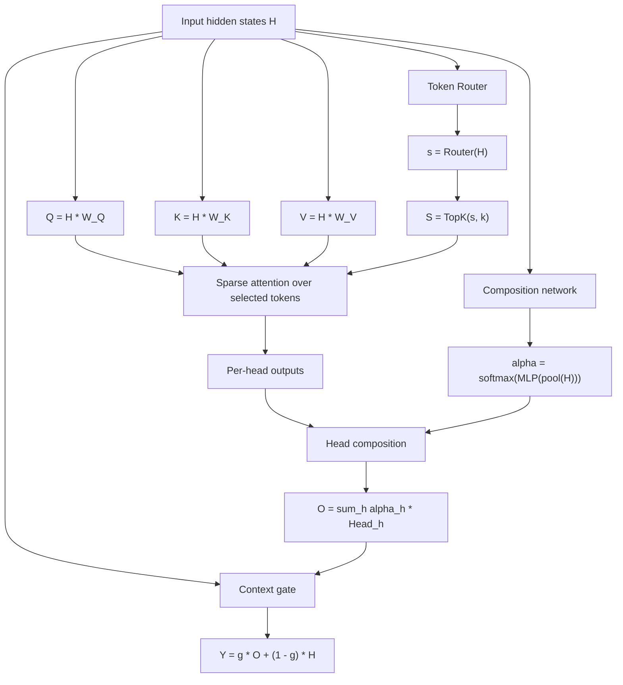

# Dynamic Composable Sparse Attention

> **Proprietary software — All rights reserved.**

Dynamic Composable Sparse Attention (DCSA) is a research-focused Transformer attention variant for autoregressive language modeling that combines dynamic token routing, sparse attention computation, and input-dependent head composition. This repository provides a clean PyTorch implementation designed for reproducible experimentation, baseline comparison, and future paper development.

## Motivation

Transformers often spend most attention compute on tokens and heads that contribute unevenly across contexts. DCSA is designed to explore a quality-efficiency tradeoff by targeting three common sources of redundancy:

- **Token redundancy:** many tokens are less informative for each step.
- **Head redundancy:** not all attention heads are equally useful for every context.
- **Static computation:** dense attention and fixed head aggregation can be wasteful.

## Key Ideas

1. **Dynamic token routing** scores hidden states and selects top-k candidate tokens.
2. **Sparse attention** computes attention only over selected tokens (with causal constraints).
3. **Dynamic head composition** computes context-dependent head mixing weights.
4. **Context gate (optional)** blends composed attention output with the residual stream.

## Architecture Overview

### High-level model



### Mathematical flow



## Mathematical Formulation

Let `H` be input hidden states of shape `(N x d)` for sequence length `N` and hidden size `d`.

- `Q = H * W_Q`
- `K = H * W_K`
- `V = H * W_V`

Token routing:

- `s = Router(H)`
- `S = TopK(s, k)`

Sparse attention over selected tokens only:

- `A_ij = softmax(Q_i K_j^T / sqrt(d_h))` over `j in S`

Per-head output:

- `Head_h(i) = sum_{j in S} A_ij^(h) * V_j`

Dynamic head composition:

- `alpha = softmax(MLP(pool(H)))`
- `O = sum_h alpha_h * Head_h`

Context gate:

- `g = sigmoid(W_g H)`
- `Y = g * O + (1 - g) * H`

Compact DCSA expression:

- `Y = Gate(H, Compose(SparseAttn(Q(H), K(H)_S, V(H)_S), H))`

## Benchmark Plan

Primary benchmark path is autoregressive language modeling with a baseline dense-attention decoder-only model versus DCSA. Initial experiments should report:

- next-token cross-entropy loss
- perplexity
- throughput (tokens/second)
- trainable parameter count
- approximate dense vs sparse attention cost term

The repository includes scripts for tiny random/patterned datasets to enable quick smoke tests and controlled ablations.

## Repository Layout

```text
.
├── README.md
├── pyproject.toml
├── configs/
│   ├── tiny_baseline_lm.yaml
│   ├── tiny_dcsa_lm.yaml
│   └── small_benchmark.yaml
├── dcsa/
│   ├── modules/attention.py
│   ├── models/blocks.py
│   ├── models/language_models.py
│   ├── training/trainer.py
│   ├── eval/metrics.py
│   └── utils/{config.py,data.py}
├── scripts/
│   ├── train_lm.py
│   ├── eval_lm.py
│   └── benchmark_attention.py
└── tests/
    ├── test_attention_components.py
    └── test_models.py
```

## Quickstart

### 1) Install dependencies

```bash
python -m venv .venv
source .venv/bin/activate
pip install -e .
```

### 2) Run tests

```bash
pytest -q
```

### 3) Train tiny DCSA LM

```bash
python scripts/train_lm.py --config configs/tiny_dcsa_lm.yaml
```

### 4) Evaluate tiny DCSA LM

```bash
python scripts/eval_lm.py --config configs/tiny_dcsa_lm.yaml
```

### 5) Benchmark baseline vs DCSA attention path

```bash
python scripts/benchmark_attention.py --seq-len 64 --batch-size 4 --d-model 128 --n-heads 4 --n-layers 2 --top-k 16
```

## Example Commands

- Baseline training:
  - `python scripts/train_lm.py --config configs/tiny_baseline_lm.yaml`
- DCSA training:
  - `python scripts/train_lm.py --config configs/tiny_dcsa_lm.yaml`
- DCSA evaluation:
  - `python scripts/eval_lm.py --config configs/tiny_dcsa_lm.yaml`

## Ablation Ideas

- Vary `top_k` to study sparsity-quality tradeoff.
- Disable context gate to isolate routing/composition effects.
- Replace dynamic head composition with uniform head averaging.
- Compare random token selection vs learned routing.
- Sweep number of heads and depth under fixed compute budgets.

## Future Work

- Extend to larger corpora and longer context windows.
- Add mixed precision and distributed training support.
- Explore learned or adaptive `k` schedules.
- Add structured sparse kernels and fused implementations.
- Test transfer to code modeling and instruction-tuning regimes.

## Notes

This repository intentionally prioritizes readability and modular experimentation over kernel-level optimization.
